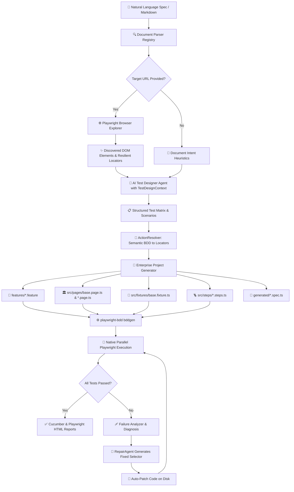

<div align="center">


# 🛡️ Karsa Sentinel

### **Autonomous AI QA Automation Agent & Enterprise BDD Test Generator**

*AI Proposes. Sentinel Verifies.*

[](https://www.npmjs.com/package/karsa-sentinel)
[](https://opensource.org/licenses/MIT)
[](https://nodejs.org/)
[](https://www.typescriptlang.org/)
[](https://playwright.dev/)
[](https://vitalets.github.io/playwright-bdd/)

</div>

---

## 📑 Table of Contents
- [📖 Product Vision & Philosophy](#-product-vision--philosophy)
- [🏛️ Enterprise Architecture](#️-enterprise-architecture)
- [🔄 Autonomous Pipeline Flow](#-autonomous-pipeline-flow)
- [🚀 Key Capabilities](#-key-capabilities)
- [📁 Project Structure](#-project-structure)
- [⚡ Quick Start Guide](#-quick-start-guide)
- [🏗️ Generation Modes (`enterprise` vs `standalone`)](#️-generation-modes-enterprise-vs-standalone)
- [🤖 Supported AI Providers](#-supported-ai-providers)
- [⚙️ Configuration (`.env`)](#️-configuration-env)
- [💻 CLI Reference](#-cli-reference)
- [🩹 Autonomous Self-Healing](#-autonomous-self-healing)
- [🐞 Real-Time Debug Tracing (`-d`)](#-real-time-debug-tracing--d)
- [🔌 Programmatic TypeScript API](#-programmatic-typescript-api)
- [📊 Knowledge Graph (Graphify)](#-knowledge-graph-graphify)
- [🛠️ Local Development & Testing](#️-local-development--testing)
- [📄 License](#-license)

---

## 📖 Product Vision & Philosophy

Modern software testing is bottlenecked by the manual effort required to write, scaffold, and maintain end-to-end automation scripts as user interfaces evolve.

**Karsa Sentinel** bridges product intent and executable test verification. It takes natural language requirements (Markdown, Jira specs, PRDs) and pairs LLM intelligence with real browser DOM inspection to output deterministic, enterprise-grade **Playwright BDD test suites (`playwright-bdd`)**, **OOP Page Objects extending `BasePage`**, **Step Definitions (`createBdd`)**, and **Typed Dependency Injection Fixtures (`test.extend`)** with **autonomous self-repair capabilities**.

> ### 💡 Core Tenet: *AI Proposes. Sentinel Verifies.*
> LLMs generate hypotheses (test scenarios and semantic intent). Sentinel independently discovers live DOM elements, resolves semantic actions to resilient selectors, and verifies test execution with native Playwright assertions before committing code.

---

## 🏛️ Enterprise Architecture

```text
┌────────────────────────────────────────────────────────────────────────────────────────┐
│                                 KARSA SENTINEL CORE                                    │
└───────────────────────────────────────────┬────────────────────────────────────────────┘
                                            │
               ┌────────────────────────────┼────────────────────────────┐
               ▼                            ▼                            ▼
  ┌─────────────────────────┐  ┌─────────────────────────┐  ┌─────────────────────────┐
  │   1. INTENT INGESTION   │  │   2. DOM EXPLORATION    │  │     3. AI SYNTHESIS     │
  │ • Markdown Parser       │  │ • Headless Crawler      │  │ • 9Router Proxy (mimo)  │
  │ • Jira / PRD Extractors │  │ • Accessibility Tree    │  │ • OpenAI (gpt-4o)       │
  │ • URL & Scenario Parse  │  │ • Resilient Locators    │  │ • Gemini 1.5 Pro        │
  └────────────┬────────────┘  └────────────┬────────────┘  └────────────┬────────────┘
               │                            │                            │
               └────────────────────────────┼────────────────────────────┘
                                            │
                                            ▼
                               ┌─────────────────────────┐
                               │   4. ACTION RESOLVER    │
                               │ • Semantic Step Match   │
                               │ • DOM Evidence Mapping  │
                               │ • AutomationAction IR   │
                               └────────────┬────────────┘
                                            │
                                            ▼
                               ┌─────────────────────────┐
                               │ 5. ARTIFACT GENERATION  │
                               │ • Gherkin .feature      │
                               │ • BasePage & Page Object│
                               │ • Step Definitions      │
                               │ • base.fixture.ts (DI)  │
                               └────────────┬────────────┘
                                            │
                                            ▼
                               ┌─────────────────────────┐
                               │  6. BDDGEN & EXECUTION  │
                               │ • playwright-bdd        │
                               │ • Native Parallel Run   │
                               │ • Live Locator Auto-Fix │
                               └────────────┬────────────┘
                                            │
                                            ▼
                               ┌─────────────────────────┐
                               │  7. REPORTS & TRACING   │
                               │ • Cucumber HTML Report  │
                               │ • Playwright HTML Report│
                               │ • Real-time Trace Logs  │
                               └─────────────────────────┘
```

---

## 🔄 Autonomous Pipeline Flow



---

## 🚀 Key Capabilities

### 1. 🥒 Enterprise BDD with `playwright-bdd` (`bddgen`)
- Human-readable Gherkin `.feature` files serve as the **first-class executable test specification**.
- `bddgen` transpiles `.feature` files and step definitions into native Playwright specs under `.features-gen/`.
- Full retention of all native Playwright capabilities:
  - Parallel execution across all CPU cores (`fullyParallel: true`)
  - Trace Viewer (`trace: 'retain-on-failure'`)
  - Interactive UI mode (`npx playwright test --ui`)
  - Cross-browser testing (Chromium, Firefox, WebKit)

### 2. 🏛️ Page Object Model (POM) + `BasePage` Hierarchy
- Generates abstract **`BasePage`** providing `navigate()`, non-blocking `getErrorMessage()`, and `getTitleText()`.
- Generates domain Page Objects extending `BasePage` with:
  - Strongly typed locators (`readonly usernameInput: Locator;`)
  - Auto-synthesized action methods (`login(username, password)`, `submitForm(data)`, `isLoaded()`)

### 3. 💉 Zero-Boilerplate Fixture Dependency Injection (`base.fixture.ts`)
- Extends Playwright's `test` runner with typed Page Object fixtures:
  ```typescript
  export const test = baseTest.extend<Pages>({
    loginPage: async ({ page }, use) => {
      await use(new LoginPage(page));
    },
  });
  ```
- Step definitions destructure `{ loginPage }` directly without manual `new LoginPage(page)` instantiations.

### 4. 🧭 Semantic Action Resolver (`ActionResolver`)
- Bridges human-written Gherkin steps to live DOM locators using fuzzy matching across element names, roles, text, and attributes.
- Prioritizes resilient selectors (`data-test`, `getByRole`, `placeholder`, `aria-label`).

### 5. 🩹 Autonomous Self-Healing Loop
- Catches broken locators (e.g. selector typos or DOM refactors) during test execution.
- Automatically pinpoints the failing line, proposes the correct locator, patches the code on disk, and re-executes tests until green.

---

## 📁 Project Structure

```text
karsa-sentinel/
├── assets/                  # Project brand assets (logo, badges)
├── features/                # 🥒 Gherkin BDD Feature specifications
│   └── *.feature
├── src/
│   ├── agents/              # Autonomous agent layer
│   │   ├── orchestrator/    # Central pipeline coordinator
│   │   ├── explorer/        # Headless web crawler agent
│   │   ├── test-designer/   # AI test scenario planner
│   │   ├── bdd-generator/   # Gherkin scenario synthesizer
│   │   ├── automation/      # Playwright spec generator
│   │   ├── execution/       # Test runner & self-healing manager
│   │   ├── repair/          # Locator diagnosis and repair agent
│   │   └── requirement/     # Requirement extractor agent
│   ├── core/                # Core architecture & contracts
│   │   ├── models/          # TypeScript domain models
│   │   ├── schemas/         # Zod validation schemas
│   │   ├── contracts/       # Interfaces (IAIProvider, IDocumentParser, etc.)
│   │   ├── logger/          # Categorized real-time debug logger
│   │   └── pipeline/        # Step execution pipeline
│   ├── crawler/             # Live browser inspection
│   │   ├── browser/         # Playwright browser lifecycle manager
│   │   ├── discovery/       # DOM element extraction engine
│   │   └── locators/        # Resilient locator candidate ranking
│   ├── documents/           # Intent document parsers
│   │   ├── markdown/        # Markdown requirement parser
│   │   └── parser/          # Parser registry
│   ├── resolver/            # Semantic BDD to DOM locator mapping
│   │   └── action/          # ActionResolver implementation
│   ├── generators/          # Code generation engines
│   │   ├── bdd/             # Gherkin formatter & normalizer
│   │   ├── page-object/     # BasePage & domain Page Object generator
│   │   ├── fixture/         # base.fixture.ts DI generator
│   │   ├── steps/           # playwright-bdd createBdd step generator
│   │   ├── playwright/      # Standalone Playwright spec generator
│   │   └── project/         # Enterprise suite orchestrator
│   ├── fixtures/            # 💉 Dependency Injection fixture bindings
│   │   └── base.fixture.ts
│   ├── pages/               # 📦 Domain Page Objects (LoginPage, etc.)
│   │   └── base.page.ts
│   ├── steps/               # 🪜 Gherkin step definitions (createBdd)
│   │   └── *.steps.ts
│   ├── execution/           # Test execution & triage
│   │   ├── runner/          # Playwright test process runner (auto-runs bddgen)
│   │   ├── reporter/        # Summary result reporter
│   │   └── failure-analysis/# Failure category classifier (LOCATOR_MISMATCH, etc.)
│   ├── memory/              # Local memory & caching
│   │   ├── requirements/    # Intent requirements store
│   │   ├── application/     # Discovered UI elements cache
│   │   └── automation/      # Generated test artifacts registry
│   ├── providers/           # AI provider adapters
│   │   ├── nine-router/     # 9Router OpenAI-compatible proxy adapter
│   │   ├── openai/          # Direct OpenAI GPT-4o adapter
│   │   ├── gemini/          # Google Gemini 1.5 adapter
│   │   └── router/          # Dynamic provider router & Mock fallback
│   ├── cli/                 # Commander.js CLI executable
│   └── index.ts             # Public library barrel export
├── playwright.config.ts     # ⚙️ defineBddConfig & Cucumber HTML report config
├── package.json
└── tsconfig.json
```

---

## ⚡ Quick Start Guide

### 1. Initialize your project
```bash
npx karsa-sentinel init
```
*Automatically creates `playwright.config.ts` (with `defineBddConfig` & HTML reports), `src/pages/base.page.ts`, `src/fixtures/base.fixture.ts`, `.env.example`, and npm scripts.*

### 2. Write your requirement (`docs/login.md`)
```markdown
# Feature: SauceDemo Authentication Matrix

## Target URL
`https://www.saucedemo.com/`

## Scenarios

### Scenario 1: Standard User Login Success
- **Given** user navigates to `https://www.saucedemo.com/`
- **When** user enters username `standard_user`
- **And** user enters password `secret_sauce`
- **And** user clicks the Login button
- **Then** user is redirected to `/inventory.html`
- **And** header title displays "Products"

### Scenario 2: Locked Out User Error Banner
- **Given** user navigates to `https://www.saucedemo.com/`
- **When** user enters username `locked_out_user`
- **And** user enters password `secret_sauce`
- **And** user clicks the Login button
- **Then** error message "Epic sadface: Sorry, this user has been locked out." is displayed
```

### 3. Generate & Run
```bash
# Generate Enterprise BDD Features, Page Objects, Fixtures & Step Definitions
npm run generate

# Run tests (auto-compiles with bddgen and executes with Playwright)
npm test

# Open interactive HTML report
npm run report
```

---

## 🏗️ Generation Modes (`enterprise` vs `standalone`)

| Mode | Command | Output Structure | Best For |
| :--- | :--- | :--- | :--- |
| **`enterprise`** *(Default)* | `karsa-sentinel generate <doc>` | `features/*.feature`<br>`src/pages/*.page.ts`<br>`src/fixtures/base.fixture.ts`<br>`src/steps/*.steps.ts` | Production test suites, maintainable POM architecture, multi-page web applications |
| **`standalone`** | `karsa-sentinel generate <doc> --mode=standalone` | `generated/*.feature`<br>`generated/*.spec.ts`<br>`generated/pages/*Page.ts` | Quick prototyping, single-file scripts, lightweight verification |

---

## 🤖 Supported AI Providers

| Provider                | Description                                                                     | Required Environment Variables                                                                                                           |
| :------------------------| :--------------------------------------------------------------------------------| :-----------------------------------------------------------------------------------------------------------------------------------------|
| **9Router** *(Default)* | OpenAI-compatible local/cloud proxy routing to high-speed models (`mimo`, etc.) | `AI_PROVIDER=9router`<br>`NINE_ROUTER_BASE_URL=http://localhost:20218/v1`<br>`NINE_ROUTER_AUTH_TOKEN=sk-...`<br>`NINE_ROUTER_MODEL=mimo` |
| **OpenAI**              | Direct OpenAI API connection                                                    | `AI_PROVIDER=openai`<br>`OPENAI_API_KEY=sk-...`<br>`AI_MODEL=gpt-4o`                                                                     |
| **Google Gemini**       | Google Generative AI                                                            | `AI_PROVIDER=gemini`<br>`GEMINI_API_KEY=...`<br>`AI_MODEL=gemini-1.5-pro`                                                                |
| **Mock**                | Deterministic offline provider for local testing and CI/CD pipelines            | `AI_PROVIDER=mock` *(fallback if no keys provided)*                                                                                      |

---

## ⚙️ Configuration (`.env`)

```env
# ── AI Provider Configuration ────────────────────────────────
AI_PROVIDER=9router # 9router | openai | gemini | mock

# ── 9Router AI Proxy ─────────────────────────────────────────
NINE_ROUTER_BASE_URL=http://localhost:20218/v1
NINE_ROUTER_AUTH_TOKEN=sk-your-token-here
NINE_ROUTER_MODEL=mimo

# ── Target Web Application ───────────────────────────────────
BASE_URL=https://www.saucedemo.com

# ── Playwright Configuration ─────────────────────────────────
PLAYWRIGHT_HEADLESS=true
PLAYWRIGHT_TIMEOUT=30000

# ── Sentinel Autonomous Self-Healing & Debugging ─────────────
MAX_REPAIR_ATTEMPTS=3
DEBUG=false
```

---

## 💻 CLI Reference

### `karsa-sentinel init`
Initializes workspace with Enterprise BDD configuration, `BasePage`, typed fixtures, and sample specs.
```bash
karsa-sentinel init [-d]
```

### `karsa-sentinel generate <documentPath>`
Generates BDD features, Page Objects, step definitions, and fixtures from an intent document.
```bash
karsa-sentinel generate <documentPath> [options]
```

#### Options:
- `-m, --mode <mode>`: Generation mode: `enterprise` (default) | `standalone`.
- `-d, --debug`: Enable detailed debug mode with verbose log tracing.
- `-o, --output <dir>`: Directory where generated files will be written *(default: `generated`)*.
- `-p, --provider <name>`: Override AI provider (`9router` | `openai` | `gemini` | `mock`).
- `--model <name>`: Override AI model name (e.g. `mimo`, `gpt-4o`).
- `--skip-crawl`: Skip live browser DOM exploration.

### `karsa-sentinel run [testPath]`
Executes Playwright tests (auto-compiles with `bddgen`) with autonomous failure diagnosis and live self-repair.
```bash
karsa-sentinel run [testPath] [-r, --repair] [-d, --debug]
```

---

## 🩹 Autonomous Self-Healing

When running tests via `karsa-sentinel run` or `npm test`, Sentinel actively monitors test output for selector errors:

```text
$ npx karsa-sentinel run

🛡️  Karsa Sentinel: Running test suite ...

========================================
Test Run Result: FAILED
========================================

🩹 Karsa Sentinel Self-Repair: Attempt 1/3 healing failing test...
   🔍 Detected Broken Locator: [data-test="error"], [class*="erroor"] in generated/saucedemo-authentication-matrix.spec.ts
   ✨ Self-Healing Proposal: Replace with [data-test="error"], [class*="error"]
   💾 Patched code successfully. Re-running test suite...

========================================
Test Run Result: PASSED
========================================

🎉 Self-Healing Succeeded! All tests are now passing.
```

---

## 🐞 Real-Time Debug Tracing (`-d`)

Run any command with the **`-d`** flag to inspect the entire agent thought process and network activity:

```text
[DEBUG:CLI:INIT] Debug mode enabled. Verbose tracing is ACTIVE.
[DEBUG:ORCHESTRATOR:PARSER] Parsed requirement: "SauceDemo Authentication Matrix" (4 scenarios)
[DEBUG:BROWSER:LAUNCH] Launching Chromium browser (headless=true)
[DEBUG:EXPLORER:DOM] Discovered 9 raw DOM elements on page
[DEBUG:EXPLORER:LOCATORS] Top discovered element candidates:
[
  { "tag": "input", "name": "user-name", "bestLocator": "[data-test=\"username\"]", "confidence": 0.99 },
  { "tag": "input", "name": "password", "bestLocator": "[data-test=\"password\"]", "confidence": 0.99 }
]
[DEBUG:9ROUTER:HTTP] Sending POST to http://localhost:20218/v1/chat/completions with model [mimo]
[DEBUG:9ROUTER:USAGE] Tokens: 3112 (prompt: 2469, completion: 643)
[DEBUG:JSON:EXTRACT_SUCCESS] Successfully parsed JSON structure
[DEBUG:ORCHESTRATOR:COMPLETE] Wrote artifacts to features/, src/pages/, src/steps/, src/fixtures/
```

---

## 🔌 Programmatic TypeScript API

```typescript
import { SentinelOrchestrator, NineRouterProvider, logger } from "karsa-sentinel";

// Optional: Enable debug mode
logger.setDebug(true);

const provider = new NineRouterProvider({
  baseUrl: "http://localhost:20218/v1",
  authToken: "sk-...",
  model: "mimo",
});

const orchestrator = new SentinelOrchestrator(provider);
const result = await orchestrator.generate({
  documentPath: "./docs/login.md",
  mode: "enterprise",
});

console.log("Feature created at:    ", result.featureFile);
console.log("Steps created at:      ", result.stepFile);
console.log("Page Object created at:", result.pageObjectFile);
console.log("Fixture created at:    ", result.fixtureFile);
```

---

## 📊 Knowledge Graph (Graphify)

The codebase architecture is mapped using **Graphify**. You can open the interactive visualizer in any web browser without needing a server:

```bash
# Open interactive knowledge graph in browser
open graphify-out/graph.html
```

---

## 🛠️ Local Development & Testing

```bash
# Clone the repository
git clone https://github.com/skeithnight/karsa-sentinel.git
cd karsa-sentinel

# Install dependencies
npm install

# Run Vitest unit tests
npm test

# Typecheck TypeScript
npm run typecheck

# Build library bundle & CLI executable
npm run build
```

---

## 📄 License
[MIT](LICENSE) © [skeithnight](https://github.com/skeithnight)
