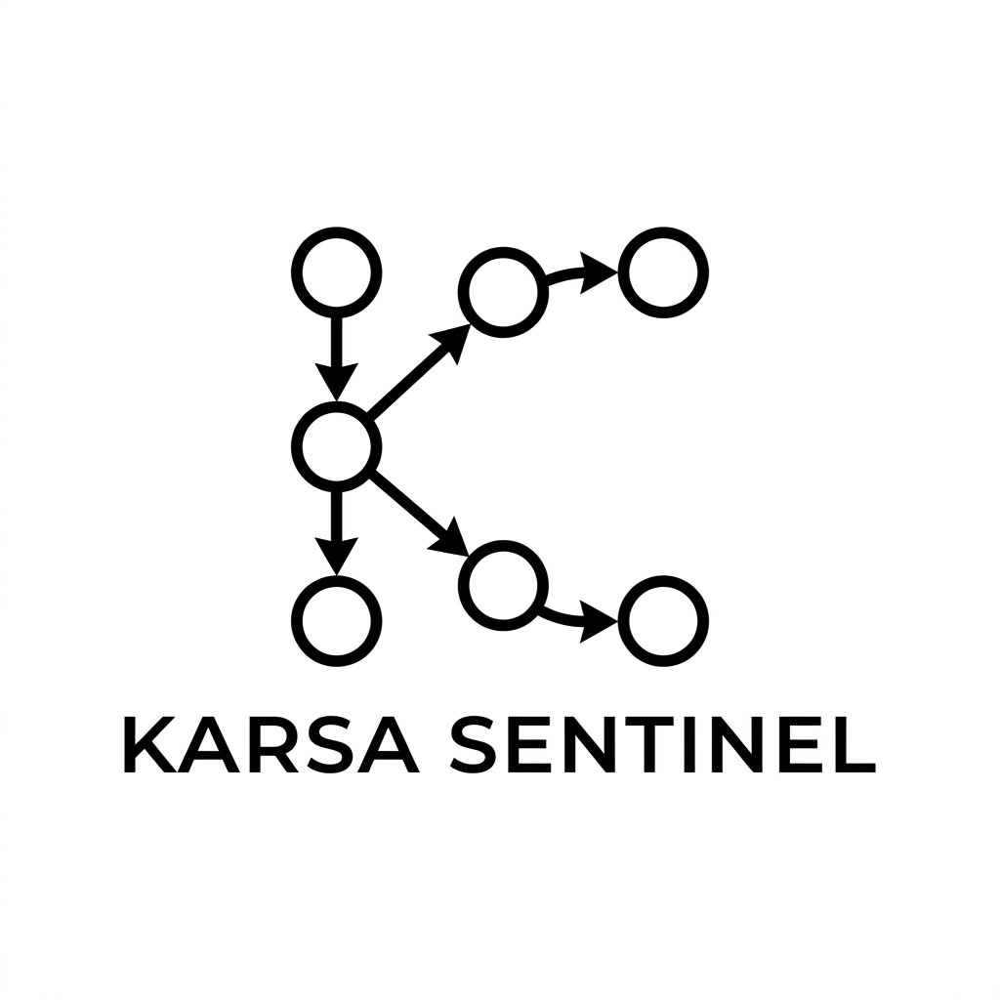
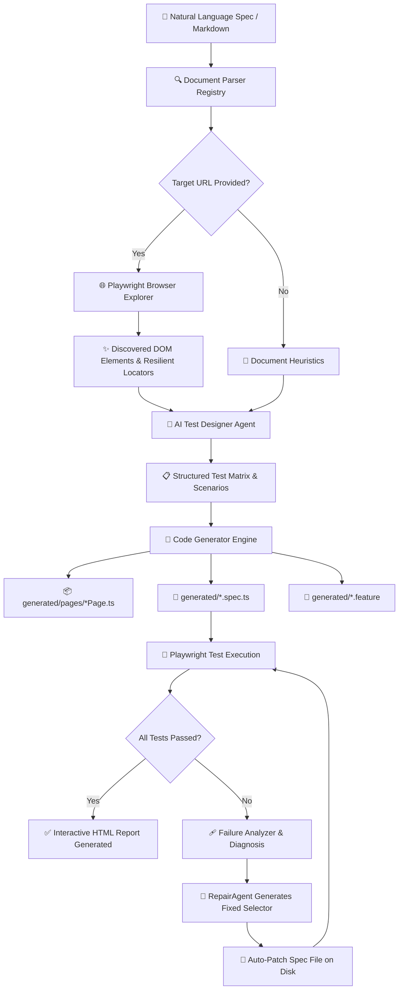

<div align="center">



# 🛡️ Karsa Sentinel

### **Autonomous AI QA Automation Agent & Intent-to-Execution Engine**

*AI Proposes. Sentinel Verifies.*

[](https://www.npmjs.com/package/karsa-sentinel)
[](https://opensource.org/licenses/MIT)
[](https://nodejs.org/)
[](https://www.typescriptlang.org/)
[](https://playwright.dev/)

</div>

---

## 📑 Table of Contents
- [📖 Product Vision & Philosophy](#-product-vision--philosophy)
- [🏛️ System Architecture](#️-system-architecture)
- [🔄 Autonomous Pipeline Flow](#-autonomous-pipeline-flow)
- [🚀 Key Capabilities](#-key-capabilities)
- [📁 Project Structure](#-project-structure)
- [⚡ Quick Start Guide](#-quick-start-guide)
- [🤖 Supported AI Providers](#-supported-ai-providers)
- [⚙️ Configuration (`.env`)](#️-configuration-env)
- [💻 CLI Reference](#-cli-reference)
- [🩹 Autonomous Self-Healing](#-autonomous-self-healing)
- [🐞 Real-Time Debug Tracing (`-d`)](#-real-time-debug-tracing--d)
- [🔌 Programmatic TypeScript API](#-programmatic-typescript-api)
- [📊 Knowledge Graph (Graphify)](#-knowledge-graph-graphify)
- [🛠️ Local Development & Testing](#️-local-development--testing)
- [📄 License](#-license)

---

## 📖 Product Vision & Philosophy

Modern software testing is bottlenecked by the manual effort required to write, scaffold, and maintain end-to-end automation scripts as user interfaces evolve.

**Karsa Sentinel** bridges product intent and executable test verification. It takes natural language requirements (Markdown, Jira specs, PRDs) and pairs LLM intelligence with real browser DOM inspection to output deterministic, resilient **Playwright TypeScript test suites**, **BDD Gherkin features**, and **typed Page Objects** with **autonomous self-repair capabilities**.

> ### 💡 Core Tenet: *AI Proposes. Sentinel Verifies.*
> LLMs generate hypotheses (test scenarios and selectors). Sentinel independently verifies them against the live DOM and Playwright test assertions before committing code.

---

## 🏛️ System Architecture

```text
┌────────────────────────────────────────────────────────────────────────────────────────┐
│                                 KARSA SENTINEL CORE                                    │
└───────────────────────────────────────────┬────────────────────────────────────────────┘
                                            │
               ┌────────────────────────────┼────────────────────────────┐
               ▼                            ▼                            ▼
  ┌─────────────────────────┐  ┌─────────────────────────┐  ┌─────────────────────────┐
  │   1. INTENT INGESTION   │  │   2. DOM EXPLORATION    │  │     3. AI SYNTHESIS     │
  │ • Markdown Parser       │  │ • Playwright Crawler    │  │ • 9Router AI Proxy      │
  │ • Jira / PRD Extractors │  │ • Accessibility Tree    │  │ • OpenAI / Gemini       │
  │ • Target URL Resolver   │  │ • Resilient Locators    │  │ • Zod Schema Validation │
  └────────────┬────────────┘  └────────────┬────────────┘  └────────────┬────────────┘
               │                            │                            │
               └────────────────────────────┼────────────────────────────┘
                                            │
                                            ▼
                               ┌─────────────────────────┐
                               │ 4. ARTIFACT GENERATION  │
                               │ • Typed Page Objects    │
                               │ • Granular 1:1 Specs    │
                               │ • BDD Gherkin Features  │
                               └────────────┬────────────┘
                                            │
                                            ▼
                               ┌─────────────────────────┐
                               │  5. EXECUTION & REPAIR  │
                               │ • Playwright Test Runner│
                               │ • Failure Analyzer      │
                               │ • Live Auto-Patcher     │
                               └────────────┬────────────┘
                                            │
                                            ▼
                               ┌─────────────────────────┐
                               │  6. REPORTS & TRACING   │
                               │ • Interactive HTML      │
                               │ • Real-time Debug Logs  │
                               │ • Executive Summaries   │
                               └─────────────────────────┘
```

---

## 🔄 Autonomous Pipeline Flow



---

## 🚀 Key Capabilities

### 1. 🌐 Live Web Explorer & DOM Evidence (Phase 2)
- Automatically launches headless Chromium when a `Target URL` is provided in the intent document.
- Scans all interactive inputs, buttons, error containers, and headings.
- Ranks selectors by Playwright resiliency:
  1. `data-test` / `data-testid` (`[data-test="..."]`, confidence: `0.99`)
  2. `getByRole` with accessible names (`role=button[name="..."]`, confidence: `0.95`)
  3. `placeholder` & `aria-label` (confidence: `0.88`)
  4. Short text & Semantic CSS

### 2. 📑 Granular 1:1 Scenario & Page Object Generation
- Generates dedicated typed **Page Object classes** under `generated/pages/` (e.g. `SauceDemoAuthenticationMatrixPage.ts`).
- Generates individual `test('Scenario ...', async ({ page }) => { ... })` blocks for every scenario in the document with real step actions and assertions.

### 3. 🩹 Autonomous Self-Healing Loop
- Catches broken locators (e.g. selector typos or UI refactors) during test execution.
- Automatically pinpoints the failing line, proposes the correct locator, patches the `.spec.ts` file on disk, and re-executes the test until it passes.

### 4. 🐞 Real-Time Debug Tracing (`-d`)
- Full visibility into HTTP payloads, token usage, live DOM discovery candidates, and JSON extraction traces.

---

## 📁 Project Structure

```text
karsa-sentinel/
├── assets/                  # Project brand assets (logo, badges)
├── src/
│   ├── agents/              # Autonomous agent layer
│   │   ├── orchestrator/    # Central pipeline coordinator
│   │   ├── explorer/        # Headless web crawler agent
│   │   ├── test-designer/   # AI test scenario planner
│   │   ├── bdd-generator/   # Gherkin scenario synthesizer
│   │   ├── automation/      # Playwright spec generator
│   │   ├── execution/       # Test runner & self-healing manager
│   │   ├── repair/          # Locator diagnosis and repair agent
│   │   └── requirement/     # Requirement extractor agent
│   ├── core/                # Core architecture & contracts
│   │   ├── models/          # TypeScript domain models
│   │   ├── schemas/         # Zod validation schemas
│   │   ├── contracts/       # Interfaces (IAIProvider, IDocumentParser, etc.)
│   │   ├── logger/          # Categorized real-time debug logger
│   │   └── pipeline/        # Step execution pipeline
│   ├── crawler/             # Live browser inspection
│   │   ├── browser/         # Playwright browser lifecycle manager
│   │   ├── discovery/       # DOM element extraction engine
│   │   └── locators/        # Resilient locator candidate ranking
│   ├── documents/           # Intent document parsers
│   │   ├── markdown/        # Markdown requirement parser
│   │   └── parser/          # Parser registry
│   ├── generators/          # Code generation engines
│   │   ├── bdd/             # Gherkin formatter
│   │   ├── playwright/      # Page Object & Playwright spec generator
│   │   └── project/         # Output file scaffolder
│   ├── execution/           # Test execution & triage
│   │   ├── runner/          # Playwright test process runner
│   │   ├── reporter/        # Summary result reporter
│   │   └── failure-analysis/# Failure category classifier (LOCATOR_MISMATCH, etc.)
│   ├── memory/              # Local memory & caching
│   │   ├── requirements/    # Intent requirements store
│   │   ├── application/     # Discovered UI elements cache
│   │   └── automation/      # Generated test artifacts registry
│   ├── providers/           # AI provider adapters
│   │   ├── nine-router/     # 9Router OpenAI-compatible proxy adapter
│   │   ├── openai/          # Direct OpenAI GPT-4o adapter
│   │   ├── gemini/          # Google Gemini 1.5 adapter
│   │   └── router/          # Dynamic provider router & Mock fallback
│   ├── cli/                 # Commander.js CLI executable
│   └── index.ts             # Public library barrel export
├── scripts/                 # Publishing hooks (prepare-npm-readme.js, restore-readme.js)
├── graphify-out/            # Persistent knowledge graph (graph.html, GRAPH_REPORT.md)
├── docs/                    # Architectural specs, blueprints & example intent docs
└── tests/                   # Vitest unit test suites
```

---

## ⚡ Quick Start Guide

### 1. Initialize your project
```bash
npx karsa-sentinel init
```
*Automatically creates `playwright.config.ts` (with HTML reporting and `dotenv`), `.env.example`, starter specs, and npm scripts.*

### 2. Write your requirement (`docs/login.md`)
```markdown
# Feature: SauceDemo Authentication Matrix

## Target URL
`https://www.saucedemo.com/`

## Scenarios

### Scenario 1: Standard User Login Success
- **Given** user navigates to `https://www.saucedemo.com/`
- **When** user enters username `standard_user`
- **And** user enters password `secret_sauce`
- **And** user clicks the Login button
- **Then** user is redirected to `/inventory.html`
- **And** header title displays "Products"

### Scenario 2: Locked Out User Error Banner
- **Given** user navigates to `https://www.saucedemo.com/`
- **When** user enters username `locked_out_user`
- **And** user enters password `secret_sauce`
- **And** user clicks the Login button
- **Then** error message "Epic sadface: Sorry, this user has been locked out." is displayed
```

### 3. Generate & Run
```bash
# Generate BDD Features, Page Objects & Playwright Specs
npm run generate

# Run tests with Autonomous Self-Healing
npm test

# Open interactive HTML report
npm run report
```

---

## 🤖 Supported AI Providers

| Provider                | Description                                                                     | Required Environment Variables                                                                                                           |
| :------------------------| :--------------------------------------------------------------------------------| :-----------------------------------------------------------------------------------------------------------------------------------------|
| **9Router** *(Default)* | OpenAI-compatible local/cloud proxy routing to high-speed models (`mimo`, etc.) | `AI_PROVIDER=9router`<br>`NINE_ROUTER_BASE_URL=http://localhost:20218/v1`<br>`NINE_ROUTER_AUTH_TOKEN=sk-...`<br>`NINE_ROUTER_MODEL=mimo` |
| **OpenAI**              | Direct OpenAI API connection                                                    | `AI_PROVIDER=openai`<br>`OPENAI_API_KEY=sk-...`<br>`AI_MODEL=gpt-4o`                                                                     |
| **Google Gemini**       | Google Generative AI                                                            | `AI_PROVIDER=gemini`<br>`GEMINI_API_KEY=...`<br>`AI_MODEL=gemini-1.5-pro`                                                                |
| **Mock**                | Deterministic offline provider for local testing and CI/CD pipelines            | `AI_PROVIDER=mock` *(fallback if no keys provided)*                                                                                      |

---

## ⚙️ Configuration (`.env`)

```env
# ── AI Provider Configuration ────────────────────────────────
AI_PROVIDER=9router # 9router | openai | gemini | mock

# ── 9Router AI Proxy ─────────────────────────────────────────
NINE_ROUTER_BASE_URL=http://localhost:20218/v1
NINE_ROUTER_AUTH_TOKEN=sk-your-token-here
NINE_ROUTER_MODEL=mimo

# ── Target Web Application ───────────────────────────────────
BASE_URL=https://www.saucedemo.com

# ── Playwright Configuration ─────────────────────────────────
PLAYWRIGHT_HEADLESS=true
PLAYWRIGHT_TIMEOUT=30000

# ── Sentinel Autonomous Self-Healing & Debugging ─────────────
MAX_REPAIR_ATTEMPTS=3
DEBUG=false
```

---

## 💻 CLI Reference

### `karsa-sentinel init`
Initializes workspace with Playwright configuration, HTML reports, and sample specs.
```bash
karsa-sentinel init [-d]
```

### `karsa-sentinel generate <documentPath>`
Generates BDD features, Page Objects, and Playwright tests from an intent document.
```bash
karsa-sentinel generate <documentPath> [options]
```

#### Options:
- `-d, --debug`: Enable detailed debug mode with verbose log tracing.
- `-o, --output <dir>`: Directory where generated files will be written *(default: `generated`)*.
- `-p, --provider <name>`: Override AI provider (`9router` | `openai` | `gemini` | `mock`).
- `-m, --model <name>`: Override AI model name (e.g. `mimo`, `gpt-4o`).
- `--skip-crawl`: Skip live browser DOM exploration.

### `karsa-sentinel run [testPath]`
Executes Playwright tests with autonomous failure diagnosis and live self-repair.
```bash
karsa-sentinel run [testPath] [-r, --repair] [-d, --debug]
```

---

## 🩹 Autonomous Self-Healing

When running tests via `karsa-sentinel run` or `npm test`, Sentinel actively monitors test output for selector errors:

```text
$ npx karsa-sentinel run

🛡️  Karsa Sentinel: Running test suite (generated)...

========================================
Test Run Result: FAILED
========================================

🩹 Karsa Sentinel Self-Repair: Attempt 1/3 healing failing test...
   🔍 Detected Broken Locator: [data-test="error"], [class*="erroor"] in generated/saucedemo-authentication-matrix.spec.ts
   ✨ Self-Healing Proposal: Replace with [data-test="error"], [class*="error"]
   💾 Patched saucedemo-authentication-matrix.spec.ts successfully. Re-running test suite...

========================================
Test Run Result: PASSED
========================================

🎉 Self-Healing Succeeded! All tests are now passing.
```

---

## 🐞 Real-Time Debug Tracing (`-d`)

Run any command with the **`-d`** flag to inspect the entire agent thought process and network activity:

```text
[DEBUG:CLI:INIT] Debug mode enabled. Verbose tracing is ACTIVE.
[DEBUG:ORCHESTRATOR:PARSER] Parsed requirement: "SauceDemo Authentication Matrix" (4 scenarios)
[DEBUG:BROWSER:LAUNCH] Launching Chromium browser (headless=true)
[DEBUG:EXPLORER:DOM] Discovered 9 raw DOM elements on page
[DEBUG:EXPLORER:LOCATORS] Top discovered element candidates:
[
  { "tag": "input", "name": "user-name", "bestLocator": "[data-test=\"username\"]", "confidence": 0.99 },
  { "tag": "input", "name": "password", "bestLocator": "[data-test=\"password\"]", "confidence": 0.99 }
]
[DEBUG:9ROUTER:HTTP] Sending POST to http://localhost:20218/v1/chat/completions with model [mimo]
[DEBUG:9ROUTER:USAGE] Tokens: 3112 (prompt: 2469, completion: 643)
[DEBUG:JSON:EXTRACT_SUCCESS] Successfully parsed JSON structure
[DEBUG:ORCHESTRATOR:COMPLETE] Wrote artifacts to generated/
```

---

## 🔌 Programmatic TypeScript API

```typescript
import { SentinelOrchestrator, NineRouterProvider, logger } from "karsa-sentinel";

// Optional: Enable debug mode
logger.setDebug(true);

const provider = new NineRouterProvider({
  baseUrl: "http://localhost:20218/v1",
  authToken: "sk-...",
  model: "mimo",
});

const orchestrator = new SentinelOrchestrator(provider);
const result = await orchestrator.generate({
  documentPath: "./docs/login.md",
  outputDirectory: "./generated",
});

console.log("Feature created at:    ", result.featureFile);
console.log("Spec created at:       ", result.specFile);
console.log("Page Object created at:", result.pageObjectFile);
```

---

## 📊 Knowledge Graph (Graphify)

The codebase architecture is mapped using **Graphify**. You can open the interactive visualizer in any web browser without needing a server:

```bash
# Open interactive knowledge graph in browser
open graphify-out/graph.html
```

---

## 🛠️ Local Development & Testing

```bash
# Clone the repository
git clone https://github.com/skeithnight/karsa-sentinel.git
cd karsa-sentinel

# Install dependencies
npm install

# Run Vitest unit tests
npm test

# Typecheck TypeScript
npm run typecheck

# Build library bundle & CLI executable
npm run build
```

---

## 📄 License
[MIT](LICENSE) © [skeithnight](https://github.com/skeithnight)
