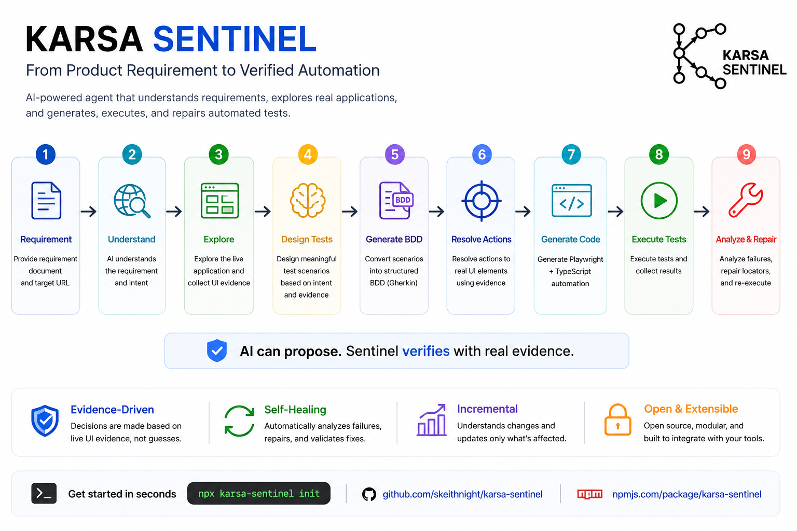

<div align="center">


# 🛡️ Karsa Sentinel

### Autonomous AI QA Automation Agent
### **From Product Intent → Verified Automation**

*AI Proposes. Sentinel Verifies.*

[](https://www.npmjs.com/package/karsa-sentinel)
[](https://opensource.org/licenses/MIT)
[](https://nodejs.org/)
[](https://www.typescriptlang.org/)
[](https://playwright.dev/)
[](https://vitalets.github.io/playwright-bdd/)

[GitHub](https://github.com/skeithnight/karsa-sentinel) · [npm](https://www.npmjs.com/package/karsa-sentinel)

</div>

---

## 📖 What is Karsa Sentinel?

Writing and maintaining end-to-end test automation is still largely manual.

You receive a PRD, BRD, Jira ticket, or Markdown specification. Then someone has to:

1. Understand the requirement
2. Inspect the application
3. Identify UI elements
4. Design test scenarios
5. Write automation code
6. Maintain broken selectors as the UI changes

**Karsa Sentinel explores a different approach.**

Give Sentinel a requirement document and a target URL:

```text
📄 Requirement + 🌐 Target URL
        ↓
🤖 Understand Product Intent
        ↓
🔎 Explore Live Application
        ↓
🧠 Collect Real UI Evidence
        ↓
🧪 Design Test Scenarios
        ↓
🥒 Generate BDD Specifications
        ↓
🧭 Resolve Actions to Real UI Elements
        ↓
⚙️ Generate Playwright + TypeScript (POM, Steps, Fixtures)
        ↓
▶️ Execute Tests in Parallel
        ↓
🔍 Analyze & Verify Live Results
```

The goal is not simply:

> *"Use AI to generate test code."*

The goal is to build a system where:

> **AI proposes automation decisions. Sentinel verifies them against real application evidence.**

---

## 🎯 Core Philosophy

### *AI Proposes. Sentinel Verifies.*

LLMs are exceptional at understanding ambiguous product requirements and proposing test scenarios.

However, an LLM should not be blindly trusted to invent selectors or assume how a web application works.

Karsa Sentinel strictly decouples intelligence from empirical evidence:

```text
AI Intelligence
     │
     ▼
"What should we test?"
     │
     ▼
Live Application Evidence
     │
     ▼
"What actually exists?"
     │
     ▼
Scored Resolution
     │
     ▼
"Can this action be safely automated?"
```

This creates a reliable, closed-loop automation pipeline:

```text
Product Intent
      ↓
AI Hypothesis
      ↓
Browser Evidence
      ↓
Confidence-Based Resolution
      ↓
Automation Generation
      ↓
Execution
      ↓
Verification & Trust Loop
```

---

## 🏛️ Architecture & Visual Overview

<div align="center">



</div>

Karsa Sentinel is organized around a clear separation between **intent**, **evidence**, **decision-making**, and **automation generation**:

```text
┌─────────────────────────────────────────────────────┐
│                   PRODUCT INTENT                    │
│        Markdown · PRD · BRD · Jira · Specs         │
└──────────────────────────┬──────────────────────────┘
                           ↓
┌─────────────────────────────────────────────────────┐
│                 INTENT INGESTION                    │
│   Parser Registry · Requirement Model · Memory      │
│   SHA-256 Content Fingerprint (Incremental Gate)    │
└──────────────────────────┬──────────────────────────┘
                           ↓
┌─────────────────────────────────────────────────────┐
│                LIVE APPLICATION                     │
│   Playwright Explorer · DOM · Accessibility Data    │
│   Resilient Locator Candidates (ApplicationMemory)  │
└──────────────────────────┬──────────────────────────┘
                           ↓
┌─────────────────────────────────────────────────────┐
│                  AI TEST DESIGN                     │
│   Test Matrix · Scenarios · Semantic Intent         │
│   TestDesignContext (Req + UI Evidence + History)   │
└──────────────────────────┬──────────────────────────┘
                           ↓
┌─────────────────────────────────────────────────────┐
│                 ACTION RESOLUTION                   │
│   Candidate Scoring · Confidence · Resolution       │
│                                                     │
│   RESOLVED · AMBIGUOUS · UNRESOLVED                │
└──────────────────────────┬──────────────────────────┘
                           ↓
┌─────────────────────────────────────────────────────┐
│                AUTOMATION ACTION IR                 │
│        Deterministic Intermediate Representation    │
└──────────────────────────┬──────────────────────────┘
                           ↓
              ┌────────────┴────────────┐
              ↓                         ↓
┌─────────────────────────┐  ┌─────────────────────────┐
│   ENTERPRISE MODE       │  │   STANDALONE MODE       │
│                         │  │                         │
│ Gherkin Features        │  │ Playwright Specs        │
│ Page Objects (BasePage) │  │ Flat .spec.ts Files     │
│ Typed Fixtures          │  │                         │
│ Step Definitions        │  │                         │
└────────────┬────────────┘  └────────────┬────────────┘
             └──────────────┬─────────────┘
                            ↓
┌─────────────────────────────────────────────────────┐
│                     EXECUTION                       │
│       playwright-bdd · Playwright · Reporting       │
└──────────────────────────┬──────────────────────────┘
                           ↓
┌─────────────────────────────────────────────────────┐
│                  VERIFY / REPAIR                    │
│   Failure Analysis · Candidate Repair · Validation  │
│   validateLocatorOnPage (Live Browser DOM Check)    │
└─────────────────────────────────────────────────────┘
```

---

## 🔄 Autonomous Pipeline Flow

```text
DOCUMENT
   ↓
Requirement Parser (DocumentParserRegistry)
   ↓
Requirement Memory / SHA-256 Fingerprint Check
   ↓ (Unchanged? ➔ Instant Reuse in < 1s)
Live Browser Exploration (ExplorerAgent)
   ↓
UI Evidence Collection (ApplicationMemory)
   ↓
AI Test Design (9Router / OpenAI / Gemini)
   ↓
BDD Scenario Generation (BDDGenerator)
   ↓
Action Resolver (Evidence-Driven Scoring)
   ↓
AutomationAction IR
   ↓
┌──────────────────────────────┐
│ RESOLVED?                    │
├──────────────┬───────────────┤
│ YES          │ NO            │
▼              ▼
Generate       Explicit
Automation     Unresolved State (test.fail)
   ↓
Playwright BDD Execution (bddgen + Playwright)
   ↓
Results / Failure Analysis (FailureAnalyzer)
   ↓
Repair Candidate Synthesis (RepairAgent)
   ↓
Live Headless Browser Validation (validateLocatorOnPage)
   ↓
Verified ➔ Apply Patch / Retry Test Suite
```

---

## 🚀 Key Capabilities

### 1. 📄 Requirement-Driven Generation
Start directly with human-readable Markdown requirements or Jira stories:

```markdown
# Feature: SauceDemo Authentication

## Target URL
https://www.saucedemo.com/

## Scenario: Successful Login
Given the user opens the login page
When the user enters username `standard_user`
And the user enters password `secret_sauce`
And the user clicks the Login button
Then the user is redirected to `/inventory.html`
And the page displays `Products`
```

Sentinel uses the requirement as the foundation for structured test generation.

---

### 2. 🔎 Live Application Exploration
When a target URL is provided, Sentinel inspects the live application using Playwright before generating code.

It extracts resilient DOM evidence such as:
* Semantic input fields and textareas
* Primary and secondary buttons
* Links and navigation elements
* `data-test`, `id`, `aria-label`, and `placeholder` attributes
* Accessible roles and text content

```text
AI Hypothesis:
"Click button with text 'Submit'"

Sentinel Live Verification:
"Discovered element <button data-test='login-button'> with confidence 0.98"
```

---

### 3. 🧪 Context-Aware AI Test Design
AI providers transform product intent and discovered UI evidence into structured test scenarios.

The AI focuses on:
* Dissecting business logic and edge cases
* Generating positive and negative paths
* Boundary value analysis
* Extracting semantic user actions

---

### 4. 🥒 Enterprise Playwright BDD
Enterprise mode automatically scaffolds clean, modular test architecture:

```text
my-project/
├── features/
│   └── authentication.feature       # 🥒 Gherkin Feature Specifications
├── src/
│   ├── pages/
│   │   ├── base.page.ts             # 🏛️ Abstract BasePage (navigate, getErrorMessage, getTitleText)
│   │   └── authentication.page.ts   # 📦 Domain Page Objects with typed locators & action methods
│   ├── fixtures/
│   │   └── base.fixture.ts          # 💉 Typed Page Object Dependency Injection (test.extend)
│   └── steps/
│       └── authentication.steps.ts  # 🪜 Step Definitions consuming Action IR (createBdd)
└── playwright.config.ts             # ⚙️ defineBddConfig & Cucumber HTML Reporter
```

---

### 5. 🧭 Scored Action Resolution & Strict Policy
Sentinel does not blindly convert AI assumptions into code:

```text
Semantic Action: "user clicks login button"
      ↓
Search Live UI Evidence (ApplicationMemory)
      ↓
Score Candidates (by Tag, Semantic Name, Attribute Match)
      ↓
Calculate Confidence Score (0.0 to 1.0)
      ↓
┌───────────────────────────────────────────┐
│ RESOLVED   ➔ Output concrete locator      │
│ AMBIGUOUS  ➔ Low confidence diagnostics   │
│ UNRESOLVED ➔ test.fail(true) explicit fail│
└───────────────────────────────────────────┘
```

**Strict Resolution Policy**: Unresolved actions emit explicit diagnostics and fail honestly, eliminating silent waits and false-positive test passes.

---

### 6. ⚡ Incremental Requirement Intelligence
Requirements are fingerprinted using SHA-256 to detect changes between test runs:

```text
New Requirement       ➔ Full Exploration & Generation
Unchanged Requirement ➔ Instant Artifact Reuse (< 1s)
Changed Requirement   ➔ Targeted Regeneration
```

---

### 7. 🩹 Self-Healing Trust Loop
When tests fail due to UI changes or selector shifts, Sentinel diagnoses the failure and initiates the **Trust Loop**:

```text
TEST FAILURE
     ↓
FailureAnalyzer Diagnoses Error Category
     ↓
RepairAgent Finds Alternative Candidate from ApplicationMemory
     ↓
Live Browser Validation: validateLocatorOnPage()
     ↓
Valid?
 ┌────┴────┐
 NO        YES
 ↓          ↓
Reject     Apply Code Patch to Disk
Fallback     ↓
To AI      Re-run Test Suite
             ↓
           Verify Green Pass!
```

> **A repair proposal is never trusted blindly — it must be validated on the live application before the code is modified.**

---

## ⚡ Quick Start Guide

### 1. Initialize a project
```bash
npx karsa-sentinel init
```
*Scaffolds `playwright.config.ts` (with `defineBddConfig` & HTML reports), `src/pages/base.page.ts`, `src/fixtures/base.fixture.ts`, `.env.example`, and npm scripts.*

### 2. Create a requirement (`docs/login.md`)
```markdown
# Feature: SauceDemo Authentication

## Target URL
https://www.saucedemo.com/

## Scenario: Standard User Login
Given the user navigates to the login page
When the user enters username `standard_user`
And the user enters password `secret_sauce`
And the user clicks the Login button
Then the user is redirected to `/inventory.html`
And the page displays `Products`
```

### 3. Generate automation
```bash
npx karsa-sentinel generate ./docs/login.md
```
*Or using project npm scripts:*
```bash
npm run generate
```

### 4. Run tests
```bash
npx karsa-sentinel run
```
*Or:*
```bash
npm test
```

---

## 🏗️ Generation Modes

| Mode | Command | Output Structure | Best For |
| :--- | :--- | :--- | :--- |
| **`enterprise`** *(Default)* | `karsa-sentinel generate <doc>` | `features/*.feature`<br>`src/pages/*.page.ts`<br>`src/fixtures/base.fixture.ts`<br>`src/steps/*.steps.ts` | Production test suites, maintainable POM architecture, multi-page applications |
| **`standalone`** | `karsa-sentinel generate <doc> --mode=standalone` | `generated/*.feature`<br>`generated/*.spec.ts`<br>`generated/pages/*Page.ts` | Quick prototyping, single-file scripts, lightweight verification |

---

## 🤖 Supported AI Providers

Karsa Sentinel supports multiple provider adapters configured via `.env`:

```env
# ── 9Router Proxy (Default) ──────────────────────────────────
AI_PROVIDER=9router
NINE_ROUTER_BASE_URL=http://localhost:20218/v1
NINE_ROUTER_AUTH_TOKEN=sk-your-token-here
NINE_ROUTER_MODEL=mimo

# ── Target Web Application ───────────────────────────────────
BASE_URL=https://www.saucedemo.com

# ── Playwright Configuration ─────────────────────────────────
PLAYWRIGHT_HEADLESS=true
PLAYWRIGHT_TIMEOUT=30000

# ── Sentinel Autonomous Self-Healing & Debugging ─────────────
MAX_REPAIR_ATTEMPTS=3
DEBUG=false
```

### Alternative Providers:

```env
# OpenAI Direct
AI_PROVIDER=openai
OPENAI_API_KEY=sk-...
AI_MODEL=gpt-4o
```

```env
# Google Gemini
AI_PROVIDER=gemini
GEMINI_API_KEY=your-api-key
AI_MODEL=gemini-1.5-pro
```

```env
# Mock Provider (Deterministic offline testing & CI/CD)
AI_PROVIDER=mock
```

---

## 💻 CLI Reference

### `karsa-sentinel init`
Initializes workspace with Enterprise BDD configuration, `BasePage`, typed fixtures, and starter files.
```bash
karsa-sentinel init [-d]
```

### `karsa-sentinel generate <documentPath>`
Generates BDD features, Page Objects, step definitions, and fixtures from an intent document.
```bash
karsa-sentinel generate <documentPath> [options]
```

#### Options:
* `-m, --mode <mode>`: Generation mode: `enterprise` (default) | `standalone`.
* `-d, --debug`: Enable detailed diagnostic logging.
* `-o, --output <dir>`: Directory where generated files will be written *(default: `generated`)*.
* `-p, --provider <name>`: Override AI provider (`9router` | `openai` | `gemini` | `mock`).
* `--model <name>`: Override AI model name (e.g. `mimo`, `gpt-4o`).
* `--skip-crawl`: Skip live browser DOM exploration.

### `karsa-sentinel run [testPath]`
Executes Playwright tests (auto-compiles with `bddgen`) with autonomous failure diagnosis and live self-repair.
```bash
karsa-sentinel run [testPath] [-r, --repair] [-d, --debug]
```

---

## 🐞 Debug Mode (`-d`)

Use `-d` or `--debug` to inspect real-time agent reasoning, DOM evidence extraction, and network interactions:

```bash
karsa-sentinel generate ./docs/login.md --debug
```

```text
[DEBUG:ORCHESTRATOR] Parsing requirement document: docs/login.md
[DEBUG:REQ_MEMORY] Fingerprint check: NEW requirement detected
[DEBUG:EXPLORER] Launching headless browser for https://www.saucedemo.com...
[DEBUG:EXPLORER] Discovered 9 interactive DOM elements
[DEBUG:ACTION_RESOLVER] "user clicks login button" ➔ [data-test="login-button"] (confidence: 0.98)
[DEBUG:PROJECT_GEN] Writing Enterprise BDD artifacts: features/, src/pages/, src/steps/, src/fixtures/
```

---

## 🔌 Programmatic TypeScript API

```typescript
import {
  SentinelOrchestrator,
  NineRouterProvider,
  logger,
} from "karsa-sentinel";

// Optional: Enable debug tracing
logger.setDebug(true);

const provider = new NineRouterProvider({
  baseUrl: "http://localhost:20218/v1",
  authToken: "sk-...",
  model: "mimo",
});

const orchestrator = new SentinelOrchestrator(provider);

const result = await orchestrator.generate({
  documentPath: "./docs/login.md",
  mode: "enterprise",
});

console.log("Feature created at:    ", result.featureFile);
console.log("Steps created at:      ", result.stepFile);
console.log("Page Object created at:", result.pageObjectFile);
console.log("Fixture created at:    ", result.fixtureFile);
```

---

## 📁 Project Structure

```text
karsa-sentinel/
├── assets/                  # Brand assets & architecture visualizations
│   ├── logo.png
│   └── karsa-sentinel-visualize.png
├── features/                # 🥒 Gherkin BDD Feature specifications
│   └── *.feature
├── src/
│   ├── agents/              # Autonomous agent layer
│   │   ├── orchestrator/    # Central pipeline coordinator & memory gate
│   │   ├── explorer/        # Headless web crawler agent
│   │   ├── test-designer/   # AI test scenario planner
│   │   ├── bdd-generator/   # Gherkin scenario synthesizer
│   │   ├── execution/       # Test runner & repair orchestrator
│   │   └── repair/          # Failure diagnosis & live browser validation
│   ├── core/                # Core architecture & contracts
│   │   ├── models/          # TypeScript domain models
│   │   ├── schemas/         # Zod validation schemas
│   │   ├── contracts/       # Interfaces (IAIProvider, IDocumentParser, etc.)
│   │   └── logger/          # Categorized real-time debug logger
│   ├── crawler/             # Live browser inspection
│   ├── documents/           # Intent document parsers (Markdown, Jira)
│   ├── resolver/            # Scored action resolution engine
│   ├── generators/          # Enterprise BDD & standalone code generators
│   ├── execution/           # Playwright runner & failure analysis
│   ├── memory/              # Requirements, Application DOM & Automation stores
│   ├── providers/           # AI adapters (9Router, OpenAI, Gemini, Mock)
│   ├── fixtures/            # 💉 Typed dependency injection fixtures
│   ├── pages/               # 📦 BasePage & domain Page Objects
│   ├── steps/               # 🪜 Gherkin step definitions (createBdd)
│   └── cli/                 # Commander.js CLI executable
├── playwright.config.ts     # ⚙️ defineBddConfig & Cucumber HTML report config
├── package.json
└── tsconfig.json
```

---

## 🛠️ Local Development & Testing

```bash
# Clone the repository
git clone https://github.com/skeithnight/karsa-sentinel.git
cd karsa-sentinel

# Install dependencies
npm install

# Run Vitest unit tests
npm test

# Typecheck TypeScript
npm run typecheck

# Build library bundle & CLI executable
npm run build
```

---

## 🤝 Contributing

Karsa Sentinel is an evolving open-source experiment around autonomous, evidence-grounded AI test engineering.

Contributions, ideas, bug reports, and architectural discussions are welcome!

See the repository: [https://github.com/skeithnight/karsa-sentinel](https://github.com/skeithnight/karsa-sentinel)

---

## 📄 License

[MIT](LICENSE) © [skeithnight](https://github.com/skeithnight)
